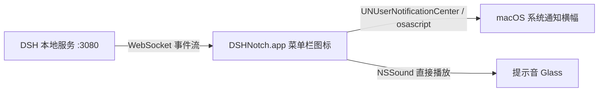

# DSH Notch Notifier（DSH 状态栏轻提醒）

> 🌐 [English](README.en.md) | 中文

在 macOS **菜单栏**常驻一个图标的小程序：当网页版 DeepSeek Harness（DSH）**执行动作、完成任务、需要你批准/回答、或出错**时，实时弹出系统通知。

- **不依赖浏览器**：直连 DSH 本地服务的 WebSocket 事件流，浏览器开着关着都行
- **原生 App**：Swift + AppKit 单文件，`swiftc` 编译，无第三方依赖
- **零改动 DSH**：只读监听，不改配置、不装插件
- **一键启动 DSH**：在终端首次跑通后，可从菜单栏直接启动，免终端

## 菜单栏图标

| 图标 | 含义 |
| --- | --- |
| ⚪ 白（模板色） | 未连接 DSH（自动重连中） |
| 🟢 绿点 | 已连接，所有会话空闲 |
| 🔵 蓝锤子 | 有会话正在运行 |
| 🟠 橙三角 | **需要你处理**（有待批准的请求 / 待回答的问题） |

> 未连接图标是 macOS 模板图标：深色菜单栏显示白色、浅色菜单栏显示黑色，永远清晰可见。

## 效果

| DSH 发生的事 | 你会看到的通知 |
| --- | --- |
| 正在执行动作（调用工具） | `🛠️ DSH 正在执行动作 — bash · 第1轮/step47：…` |
| 任务完成（回合结束） | `✅ DSH 任务完成 — 回复内容摘要` |
| 执行出错 | `❌ DSH 执行出错` |
| 超出 Token 上限 / 中止 / 受阻 | `⚠️ / ⏹️ / 🚧` |
| 请求批准（如删除文件、危险命令） | `🔔 DSH 需要你批准` |
| 提问等待回答 | `❓ DSH 在等你回答` |
| 后台任务完成/失败 | `📦 DSH 后台任务完成/失败` |
| Agent 崩溃报错 | `💥 DSH Agent 错误` |

所有通知类型都可以在菜单里单独开关，工具调用通知自带节流（默认 5 秒内同会话最多 1 条）。

**提示音**：任务完成 / 出错 / 需要批准 / 提问 / 后台任务结束 / Agent 错误 这类通知会带提示音，由 App **直接播放**（`NSSound`），不依赖 macOS 的通知声音通道——即使系统"播放用户界面声音效果"被关闭也能响。工具调用通知永远无声（防刷屏）。声音总开关在菜单「通知设置 → 🔊 播放提示音」。

## 原理

DSH 的 Web 服务（默认 `http://127.0.0.1:3080`）内置了两个**服务器→浏览器**的 WebSocket 事件流（无需鉴权，仅限本机回环）：

- `ws://127.0.0.1:3080/api/events.mux` —— 所有会话的实时事件
- `ws://127.0.0.1:3080/api/events.host` —— 宿主级事件（会话增删/运行状态/Agent 错误）

事件帧格式（`server-request` 信封）：

```json
{
  "type": "server-request",
  "rpcId": "…",
  "method": "session/event",
  "payload": {
    "type": "session/event",
    "sessionId": "session-xxx",
    "event": {
      "type": "tool/call",
      "seq": 11420,
      "time": 1786718353370,
      "data": { "turn": 1, "step": 22, "name": "bash", "arguments": "…" }
    }
  }
}
```

App 只关心这些事件：`tool/call`（执行动作）、`turn/end`（完成/出错，`reason.kind` 区分结果）、`approval/requested`、`question/requested`、`session/jobs`（后台任务）、以及 host 流的 `host/session-status`、`host/agent-error`。详见 `Sources/main.swift`。



## 从 Releases 安装（普通用户，推荐）

1. 到 [Releases 页面](https://github.com/lacemou/dsh-macos-notifier/releases) 下载 `DSHNotch-v0.1.0-macos-arm64.zip`
2. 解压得到 `DSHNotch.app`，拖入「应用程序」或直接双击运行
3. 首次打开若提示「无法验证开发者」：**右键（或 Control+点击）App → 打开 → 仍然打开**
4. 或终端执行一次：`xattr -d com.apple.quarantine "/Applications/DSHNotch.app"`

> ⚠️ 该安装包仅支持 **Apple Silicon（M 系列芯片）**。Intel Mac 用户请用源码自行编译（见下）。

## 构建与运行（开发者）

要求：macOS 13+，Xcode Command Line Tools（`xcode-select --install`）。

```bash
cd dsh-notch-notifier
./build.sh          # 编译出 dist/DSHNotch.app
open dist/DSHNotch.app
```

首次启动会请求「通知权限」：点**允许**后通知横幅走系统通知（可替换重复通知）；不授权也能用（自动降级为 osascript 横幅）。**提示音与权限无关**——由 App 直接播放，见「效果」一节。

**直接启动 DSH（免终端）**：DSH 未运行时，菜单栏图标 →「▶ 启动 DSH」，App 会在后台用 `npx @deepseek-ai/dsh web` 拉起 DSH 服务，就绪后自动打开网页；DSH 已运行时该项显示为「打开 DSH 网页」。由 App 拉起的 DSH，菜单会多出「⏹ 停止 DSH」可随时停止（外部启动的不显示）。启动日志在 `~/Library/Logs/DSHNotch-dsh.log`。

> ⚠️ 前提：请先在终端成功运行过一次 `npx @deepseek-ai/dsh web`（初始化 npx 缓存与配置），之后才能用本功能免终端启动。

> ℹ️ 生命周期：**退出 App 不会停止 DSH**——DSH 是独立服务，App 只是"扳机"；需要停止时用菜单里的「⏹ 停止 DSH」。

**退出**：点击菜单栏图标 →「退出 DSH Notch」。

**开机自启**：系统设置 → 通用 → 登录项与扩展 → 添加 `DSHNotch.app`。

## 快速上手（首次使用）

1. **先在终端跑通 DSH**（只需一次）：`npx @deepseek-ai/dsh web`，初始化 npx 缓存与配置
2. 按上面「构建与运行」编译并启动 App —— 菜单栏出现白色空心圆（⚪）图标（DSH 未运行），连上后变绿
3. 点菜单栏图标 → **测试通知**，验证横幅 + 提示音链路
4. 在 **通知设置** 里按需调整各类通知开关

## 设置

点击菜单栏图标：

- **通知设置** —— 8 个开关（见下表）+ 「🔊 播放提示音」总开关
- **🔍 通知诊断** —— 弹出窗口显示系统里本 App 的真实通知设置（授权状态 / 提醒 / 提示音 / 当前通道），排障用
- **服务器：host:port** —— 修改 DSH 地址（默认 `127.0.0.1:3080`；`dsh.yaml` 里改了 `web` 端口就改这里），并可设置启动 DSH 的命令
- **测试通知** —— 手动验证链路（含提示音）
- **最近事件** —— 最近 200 条事件记录（排障用，完整日志在 `~/Library/Logs/DSHNotch.log`）

### 通知设置开关清单

| 开关 | 默认 | 作用 |
| --- | --- | --- |
| 🛠️ 执行动作时通知（工具调用） | 开 | agent 调用工具时提醒（5 秒节流） |
| ✅ 任务完成时通知 | 开 | 回合正常结束时提醒 |
| ❌ 出错 / 中止 / 超限时通知 | 开 | 出错、中止、超出 Token 上限时提醒 |
| 🔔 需要批准时通知 | 开 | agent 请求你批准操作时提醒 |
| ❓ 提问等待回答时通知 | 开 | agent 提问等你回答时提醒 |
| 📦 后台任务完成/失败时通知 | 开 | 后台任务结束/失败时提醒 |
| 💥 Agent 错误时通知 | 开 | agent 进程级报错时提醒 |
| 🔊 播放提示音 | 开 | 提示音总开关（App 直接发声） |

## 与已有方案对比

| 方案 | 形态 | 缺点 |
| --- | --- | --- |
| **DSHNotch（本项目）** | 菜单栏原生 App | 仅 macOS；需要手动编译 |
| [omdsh-dev/dsh-notification](https://github.com/omdsh-dev/dsh-notification) | DSH 浏览器插件 | 必须开着浏览器和标签页；只通知"回合完成"；无菜单栏 |
| [AbnerAI/dsh-monitor](https://github.com/AbnerAI/dsh-monitor) | watcher 插件 | 作用是唤醒 agent 处理新消息，不是通知 |
| [qing3a/dsh-tray](https://github.com/qing3a/dsh-tray) | Windows 托盘插件 | Windows |
| [myYangyunfan/dsh_desktop](https://github.com/myYangyunfan/dsh_desktop) | Windows 桌面客户端 | Windows |

> 如果你想**完全不开浏览器**也能用，本项目是唯一选择；如果只想要浏览器内提醒，`dsh-notification` 插件一行命令就能装。

## 排障

- **图标是 ⚪ 灰色**：DSH 服务没开或端口不对 → 菜单里改服务器地址，或先启动 `dsh web`
- **收不到通知**：看 `~/Library/Logs/DSHNotch.log`，确认「已连接 /api/events.mux」；再看对应通知开关是否打开
- **没有提示音**：先看菜单「通知设置 → 🔊 播放提示音」是否打开；再点「🔍 通知诊断」确认当前通道。提示音由 App 直接播放（`NSSound`），**不依赖**系统"通知-播放提示音"和"播放用户界面声音效果"设置；如果直接播放失败，日志会记录「直接发声失败」
- **通知太频繁**：菜单 → 通知设置 → 关掉「执行动作时通知」，或改 `toolCallMinInterval`（默认 5 秒）

## 后续可扩展

- 点击通知 → 跳到对应会话（DSH 目前无深链，需服务端配合）
- 按会话/工作区过滤通知
- 菜单栏图标动画（运行中转圈）
- 用 Xcode 打包签名后上架/分发（当前为 ad-hoc 签名，仅本机可用）

## 兼容性与隐私

- **兼容性**：在 DSH `0.1.0-rc.6` 上开发与测试。事件流端点（`/api/events.mux`、`/api/events.host`）属于 DSH 的内部接口，升级 DSH 后如失效请先确认端点路径。
- **隐私**：App 只连接本机回环地址（默认 `127.0.0.1:3080`），只读事件流，**不采集、不上传任何数据**；唯一写出的文件是本地日志 `~/Library/Logs/DSHNotch.log` 与 `DSHNotch-dsh.log`。

## 技术备注

- 编译：`swiftc -O -swift-version 5 -module-cache-path build/module-cache`（模块缓存放工作区，避免写系统临时目录）
- 协议细节来自 `@deepseek-ai/dsh` npm 包（`dsh-client-connection` / `dsh-host-apiproxy`）
- 事件帧为 `server-request` 信封 + `session/event` 载荷；会话事件类型含 `turn/start`、`turn/end`、`tool/call`、`tool/result`、`assistant/message` 等
